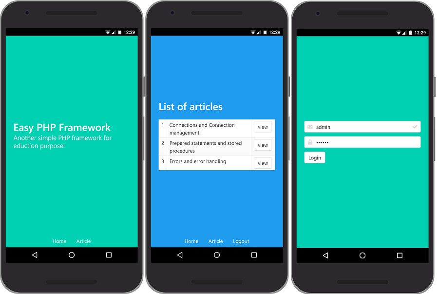

# easy
Another Simple PHP Framework For Education Purpose!

## requirement

- PHP 7
- DBMS (MySQL, PostgreSQL, etc)

## installation

Restore `easydb.sql` to Your database. 

## configuration

### database connection

Edit it in `app/config.php` file.

### web server

Place .htaccess file in to public directory

```
RewriteEngine on

# If a directory or a file exists, use the request directly
RewriteCond %{REQUEST_FILENAME} !-f
RewriteCond %{REQUEST_FILENAME} !-d
# Otherwise forward the request to index.php
RewriteRule . index.php
```

### nginx

nginx configuration

```
server_name easy.local;
root /var/www/easy/public;
index index.php index.html index.htm;

location / {
      try_files $uri $uri/ /index.php$is_args$args;
}
```

## directory structure

+ app
  + controllers
    - Site.php  -> site controller
  + views
    + default
      - login.php -> default view login
    + layout
      - main.php  -> layout file
    + site
      - index.php -> view file
  - config.php  -> configuration file
+ core
  - Application.php -> class main application
  - Controller.php  -> base controller
  - Database.php  -> class database connection
  - error.php -> error page
  - Helper.php  -> helpers
  - User.php  -> model user
+ public
  + assets -> assets folder
    + js
    + css
  - index.php -> mount point application

## another

username : admin 
password : 123456

## screenshoot




Build with love by [Hafid Mukhlasin](http://hafidmukhlasin.com)

He is author of [Be Fullstack Developer](http://bukularavelvue.com) book (Best Seller!)
